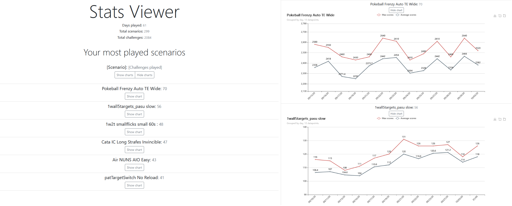

<h1 align="center">Stats Viewer</h1>

<p align="center">
    
</p>

## The tool & why
*Stats Viewer* is a helping tool to track score progress and performance improvement over time, by displaying a list **sorted by your most played scenarios** so you can focus on the bigger picture. Each scenario shows an *interactive chart* with your max and average scores.

Originally, the idea was just to list which were the scenarios I had played the most. You already have access to this information in Kovaak's, but there you have to go through tons of scenarios clicking one by one with most of them containing just a few data points, this app shows the same information but sorted by most played.


#### Features
- On the top right of each chart there is a toolbox where you can **zoom in** and **download them as an image** to share on social media.

- Hover over data points (the dots on the lines) to check the **FOV and sensibility you used to get high scores** and visualize what worked best for you.

- Toggle `max scores`, `average scores` and `7-day moving average` lines by clicking on the legend at the top of the chart.

- Quickly go to a specific scenario by using the browser's search function (`ctrl + f` by default in most browsers).


## Performance Chart BETA
Calculates your performance by getting the average score for every scenario (of that day) and converting it into a percentage of your current high score.

Example:
```
Day 1, Scenario X, current high score: 50.
Challenge scores for day 1: 40, 45, 49.
Convert those scores into a percentage of high score ((score*100) / high score): 80, 90, 98.
Day 1, Scenario X performance: 89.
```
This is done for each scenario played that day and calculating the performance average of all scenarios.


## Online sample
Not hyped yet?!

Before you download and run the tool to add value to your training and progress tracking, check out this **[online sample](https://nahuef.github.io/statsViewer/)**.


## How does it work?
The application will process the files in the `stats` folder to generate a list with a chart per scenario, and output `StatsViewer.html` file in the same directory as the tool's executable `statsViewer.exe`.

That also means that if you lost some of your stats files when switching PC's, uninstalling Kovaak's, reinstalling your operating system or by any other means, that data won't be available in the result.


## How to use
*It's super simple, I just like to write a lot.*

Basicaly you download the app, set the path to your `stats` folder (which is even optional, see third option on step 2) and run it.
1. Download and extract the latest release of the tool [here](https://github.com/nahuef/statsViewer/releases).
2. Set the path to your Kovaak's `stats` folder. There are three **different options** for this step.
    1. Are you already using [Progress Sheet Updater](https://github.com/VoltaicHQ/Progress-Sheet-Updater)? Copy the `config.json` file from that tool and paste it inside `StatsViewer` folder (the one you extracted in step 1). Done.

    2. Inside `StatsViewer` folder (the one you extracted in step 1) create a file named `config.json` and paste the following snippet:
        ```
        {
            "stats_path": "C:\\Program Files (x86)\\Steam\\steamapps\\common\\FPSAimTrainer\\FPSAimTrainer\\stats"
        }
        ```
        > Make sure you duplicate each "\\", as in the example above.

        If your steam library is not installed in the default location you will need change the path manually to point it to the right `stats` folder (Instructions: ["Find your stats folder"](docs/statsFolder.md)). Done.

    3. **For the lazy ones**. Copy the contents from `StatsViewer` folder (the one you extracted in step 1) and paste them in the same directory of your `stats` folder.

        The executable `statsViewer.exe` has to be in the same directory as the `stats` folder (not inside). Done.

        For example, if your `stats` path is
        ```
        C:\Steam\steamapps\common\FPSAimTrainer\FPSAimTrainer\stats
        ```
        You want to paste them in
        ```
        C:\Steam\steamapps\common\FPSAimTrainer\FPSAimTrainer\
        ```
3. Run the tool by executing or double clicking `statsViewer.exe`.

4. A terminal/console will open and you'll see a progress bar. Wait for a few seconds as it processes your data.

5. Once finished, that window will close itself and you should have a new file `StatsViewer.html` in the same directory as the executable `statsViewer.exe`. Double click the `.html` file to open it in your default browser. **That's it, done!**

> *TIP: Run the tool everytime you want to update the charts.*

## Upgrading version
Extract this files of the new release onto the old ones and make sure to __replace all files__.
Or extract them into a different folder and copy the config.json file to this new directory.

## Troubleshooting & support
Tested on Windows 10.

If you need some help or found a bug, feel free to [open an issue](https://github.com/nahuef/statsViewer/issues/new) or contact me via Discord at Malhumoradour#5542 and send me a screenshot of the error you found.

Suggestions and PR's welcome!


## Disclaimer
This is my first open source side project and also my first time programming in Go.

Shipping was prioritized over code quality so if you are a dev and want to check the code, I offer my sincere apology for what your eyes are about to see.


## Build it from source
Go 1.15+ required.

```bash
$ git clone https://github.com/nahuef/statsViewer
$ cd statsViewer
$ go build
```
